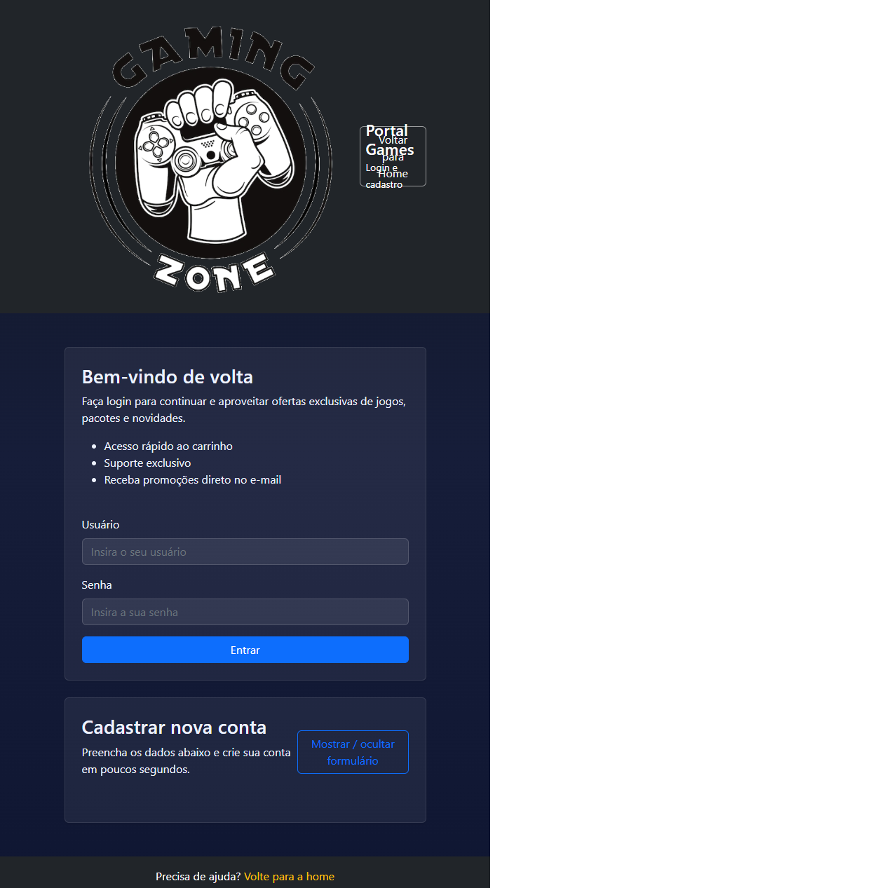
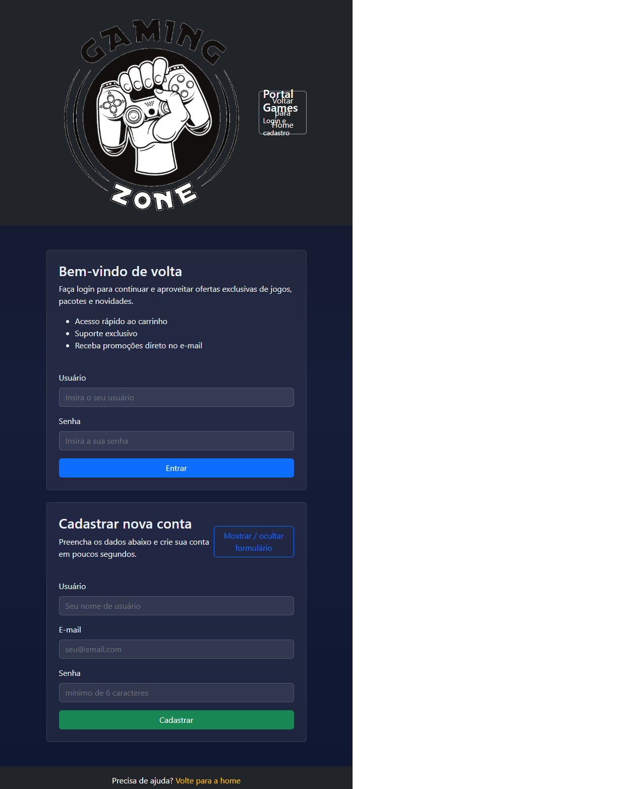

# Site Games Senai

Projeto de portfólio com página inicial e login, desenvolvido para o curso Senai.

## Tecnologias aplicadas

- HTML5
- CSS3
- Bootstrap 5
- JavaScript
- jQuery

## Funcionalidades

- Página `index.html` com:
  - menu de navegação responsivo
  - banner em carousel
  - seção de destaques
  - novidades com formulário de newsletter
  - galeria de imagens
  - rodapé com links
- Página `login.html` com:
  - formulário de login
  - formulário de cadastro com validação básica
  - botão para mostrar/ocultar o formulário de cadastro
- Interações JavaScript:
  - scroll suave para o topo
  - mensagens de feedback para ações do usuário
  - cadastro e login simulados
  - botões de novidades com alertas dinâmicos

## Prints do projeto

## Como usar

1. Abra `index.html` no navegador.
2. Navegue pelo site usando o menu.
3. Abra `login.html` para testar o formulário de login e cadastro.

## Repositório

https://github.com/Carlos-niell/Site-Games-Senai-.git
